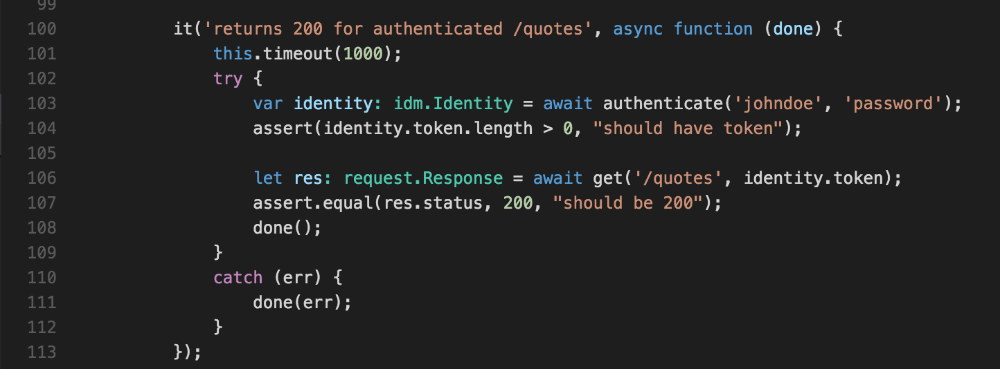

# Sane Node Development

Create a sample service which illustrates sane node development avoiding some of the historic problems.

## Eliminate Callback Hell  

Use async/await along with promises to write logical sane linear code while still maintaining the benefits of async execution

For example, in this example, each insert is sequential but still async.

```javascript
public async initialize() {
    // insert some sample data for the demo
    let sampleQuote: IQuote;

    sampleQuotes.forEach(async (sampleQuote) => {
        await this._store.insert<IQuote>(sampleQuote);
    });
}
```

An example which would be much harder to accomplish with callbacks and even solely promises.  
Notice async calls inside of loops, sequential code and easy try/catch error handling  

```javascript
// await allows us to write linear code.  
// makes it easy to also call async code in a loop
// offers easy error handling with try catch
var quotes: IQuote[];
var tries: number = 0;
while (true) {
    try {
        ++tries;
        // ASYNC/AWAIT
        quotes = await this._store.find<IQuote>({});
        break;
    }
    catch (err) {
        if (tries == 3) { throw err; }
    }
}

return quotes;
```

## Compile time support  

When working in a non-trivial code base, compile time errors are critical for early detection.

I've worked in code bases where it was manageable but became very problematic on that first big refactor.

```bash
$ tsc
app.ts(45,49): error TS2346: Supplied parameters do not match any signature of call target. 
```

Also apparent with intellisense.  In this case using [VS Code](https://code.visualstudio.com)  


## Share Code Between Server and Client

Specifically:  

  - (In progress) React components rendered server side for perf and SEO and then shared client side in the brower to resume on AJAX use.
  - (Not Started) Share validation between browser and API

Crude pattern illustrated [here](https://codepen.io/bryanmacfarlane/pen/OWVjVw)

## Debug

Illustrate how to debug

## Highly Testable and Tested

Factor code in a way to ensure all paths are testable and tested.  

Tests should be written in the same sequential async/await fashion.  



## Manageable and Scaleable

Breaking code into micro-services and layers makes code manageable and allows for independent scaling.  However, doing so requires common modules and complicates security.    

This sample will illustrate using JWT tokens for auth, CORS and a simple role based security model using Node middleware.

## API

[Api Service Here](api)

## Front End

TODO